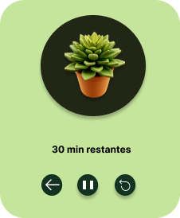

# Pomodoro

<!---Esses são exemplos. Veja https:/shields.io para outras pessoas ou para personalizar este conjunto de escudos. Você pode querer incluir dependências, status do projeto e informações de licença aqui--->

Um sistema Pomodoro desktop é um aplicativo de produtividade que ajuda os usuários a gerenciar seu tempo de trabalho e descanso usando a técnica Pomodoro. Essa técnica envolve dividir o tempo de trabalho em intervalos de 25 minutos, chamados de “pomodoros”, separados por pequenas pausas.

O aplicativo geralmente possui uma interface gráfica simples que permite aos usuários iniciar, pausar e reiniciar a contagem regressiva dos pomodoros. Ele também pode fornecer opções para personalizar a duração dos pomodoros e das pausas, bem como notificações visuais e sonoras para alertar os usuários quando um pomodoro ou uma pausa termina.

Alguns sistemas Pomodoro desktop também podem incluir recursos adicionais, como rastreamento de tarefas, estatísticas de produtividade e integração com outras ferramentas de gerenciamento de tempo e tarefas.

Em resumo, um sistema Pomodoro desktop é uma ferramenta útil para ajudar os usuários a gerenciar seu tempo de trabalho e descanso de maneira eficaz, aumentando sua produtividade e reduzindo o estresse.

### Progresso > Concluido

> Interface Home

> Interface Pomodoro

# Como baixar? 

1) Acessar a parte de release

2) Realizar download do zip

3) Extrair o zip e executar o pomodoro
